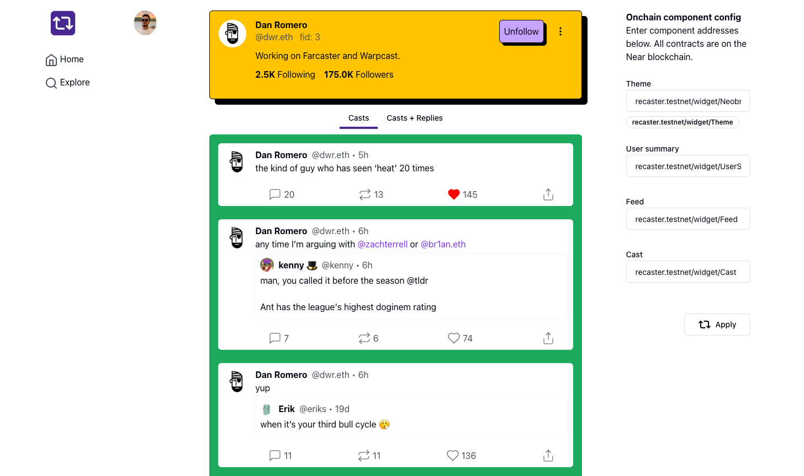

Recaster is an on-chain <i>remixable</i> Farcaster client. Recaster allows you to remix your Farcaster experience to your liking. It's available at [recaster.vercel.app](https://recaster.vercel.app/).

Recaster does not render most of the UI itself. Instead it fetches the UI (HTML) from the Near blockchain. So anyone can contribute their own components and personalize/remix their Farcaster experience.

## How does it work?

This repo is a simple Next.js wrapper around the core on-chain components. The core components of the Farcaster client like the rendering of casts, the feed, the user profile, etc happens on-chain (on Near blockchain). The Next.js wrapper is rendered off-chain. The Next.js wrapper serves the HTML returned from the on-chain contracts in kind of like an iframe.

Here are the components used in the above screenshot:

- User summary: [recaster.testnet/widget/UserSummary](/components/near-test/UserSummary.jsx)
- Feed: [recaster.testnet/widget/Feed](/components/near-test/Feed.jsx)
- Cast: [recaster.testnet/widget/Cast](/components/near-test/Cast.jsx)
- Theme: [recaster.testnet/widget/Theme](https://sepolia.basescan.org/address/0xe91b043472ba7067a898a42b1f1881713dd5c4b7#code)

There are additional component already deployed to Near blockchain which you can use by entering the address in the `On-chain component config` on the right bar of Recaster.

- Neobrutalism theme: [recaster.testnet/widget/Neobrutalism](https://sepolia.basescan.org/address/0x23f943b9bf6b6f0791ca17126ff89c2968abd6a1#code)

Here is what Neobrutalism theme looks like:

You can add your own components too! **You can remix your Farcaster experience by deploying your own components and using them permissionlessly!**

If you want to go fully trustless, you can clone this repo and serve your own wrapper. You own the entire code!

## Why on-chain UI?

UI components and smart contracts have a lot in common. They are bother very composable and benefit from being decentralized.

On-chain UI allows us to build products in a decentralized manner. Imagine building an Etherscan clone (or a Farcaster client). Someones builds a search bar, someone else builds a transaction table, etc. And the whole product can be built by small contributions from a lot of people. And these contributions can be rewarded by tokens or NFTs.

On-chain UI also opens up opportunities for UI marketplaces. People can create pretty UI components and others can use them in their projects for a small fee.

Here is the `UserSummary` component to demonstrate what on-chain UI looks like.

## Want to work together?

DM me on Twitter or Telegram (@nazar_ilamanov) and we can work on this together!
